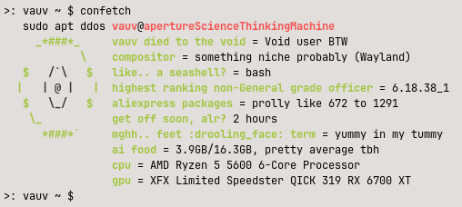
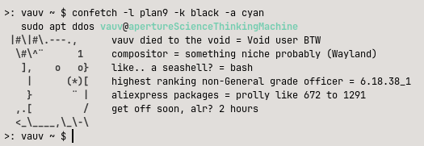
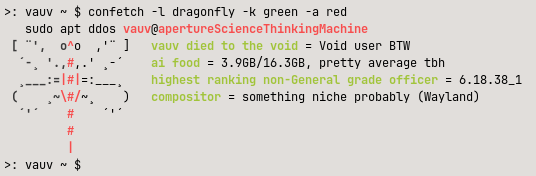

# confusingfetch
a fetch tool thats.. confused?

## Installation

1. Download the confetch file or copy it to your own
2. chmod +x confetch
3. optional, sudo/doas cp confetch /usr/local/bin/

## usage

./confetch

or if you did step 3

confetch

## flags

-v, --version
-h, --help

-l, --logo

-a, --accent

-k, --key

-L, --larp

-C, --confused

-s, --shorter

## configuration

the actual script has pretty good explanations inside of it, but anyway

 -  add modules you dont want outputted into $disabled

 -  modules order can be changed by moving them in $enabled

 -  default colours can be changed by replacing "auto" in $keycolour and $accentcolour with whatever colour you want

 -  default logo can be changed by replacing "$distro" in $logooption with whatever logo thats included

 -  make custom logos by replicating how theyre done in the file. Figure it out 

## disclaimer

currently package amount fetching is only supported for the following package managers:
- apt
- pacman
- dnf
- zypper
- xbps
- portage
- apk
- nix

>ill prolly add more package managers soon. Im js a lil lazy 

there are only ascii for the following
- void
- debian
- arch
- fedora
- opensuse
- gentoo
- nix
- alpine
- slackware
- netbsd
- openbsd
- freebsd
- dragonflybsd
- plan9
- guix
- crux
- exherbo
    
non operating systems:

- seele
- nerv
- navi

feel free to suggest ascii to add, but addition isnt guaranteed.

there isnt any bsd support YET except for there being logos for them

this is only made to work on linux so far, but should at least be pretty posix compliant

everything is only tested on my pc cause im too lazy to boot up a vm or one of my laptops

my pcs info:
- void linux glibc
- labwc (wayland)
- ryzen 5 5600
- rx 6700 xt
- 16gb ddr4 3200mhz
>will probably start testing on other stuff soon so that i can properly add support for them

## examples

## license
WTFPL — do what the fuck you want. See [LICENSE](LICENSE).

---

ik im unfunny

Dont take this lil project seriously. Started from being tired and bored at 5am

all logos made by yours truly, Erxty BTW
